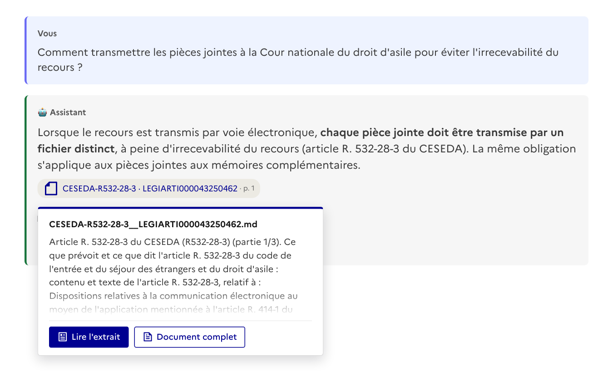
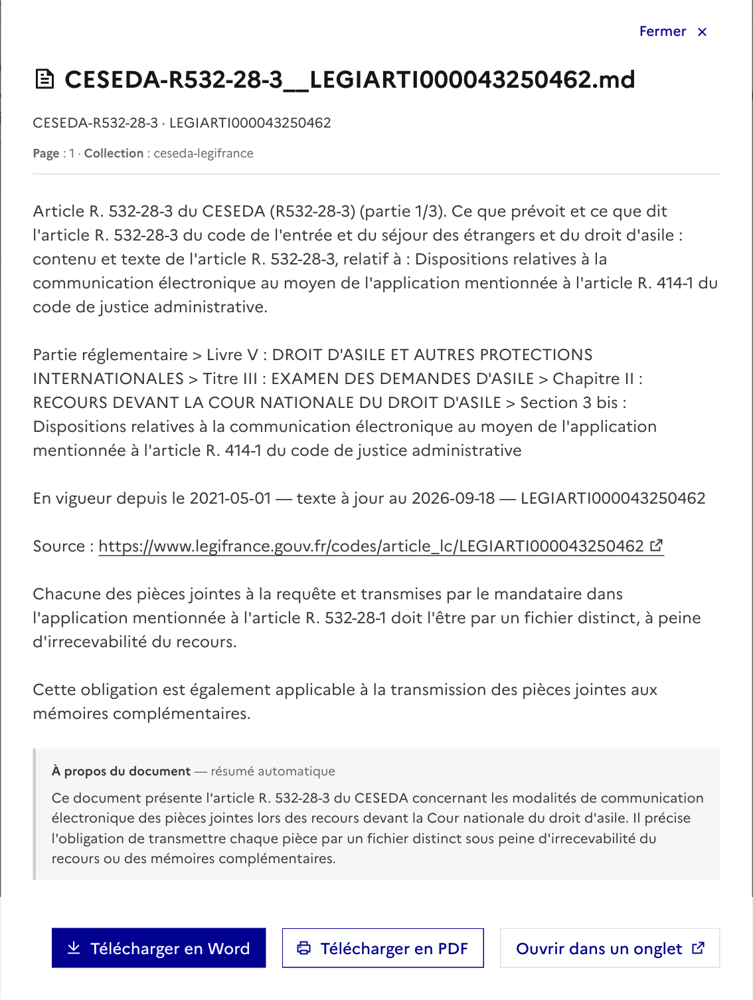
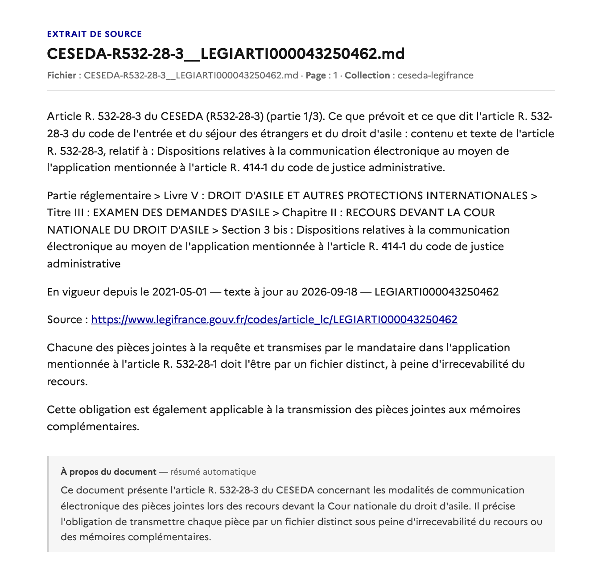

# Lire les sources d'une réponse

Dans le bac à sable d'une collection, chaque réponse de l'assistant cite les passages sur
lesquels elle s'appuie. Cette page montre ce que voit l'utilisateur, puis ce qu'il faut savoir
pour y toucher.

> Les écrans ci-dessous sont produits avec les composants de l'application et le texte de
> l'article R. 532-28-3 du CESEDA (collection `ceseda-legifrance`), sur une page d'essai
> locale — pas une capture de la production.

## Ce que voit l'utilisateur

### 1. Survoler une puce : le début du passage

Sous la réponse, une puce par document cité. Au survol — ou au focus clavier — une bulle montre
le début du passage et deux boutons.

La bulle reste ouverte le temps que la souris la rejoigne. Elle se ferme quand on s'éloigne,
quand la page défile, ou sur Échap.

### 2. Cliquer : le passage entier, sans quitter la page

Un clic sur la puce, ou sur « Lire l'extrait », ouvre une fenêtre de lecture : le passage mis en
forme, les adresses cliquables, et — quand OpenRAG en a produit un — le résumé du document dont
le passage est tiré. Le passage se télécharge en Word ou en PDF. « Document complet » ouvre
l'original dans la même fenêtre.

Ctrl-clic (ou Cmd-clic) sur la puce garde le comportement d'un lien : le passage s'ouvre dans
un onglet.

### 3. Dans un onglet : une page autonome

« Ouvrir dans un onglet », un Ctrl-clic, ou un lien cité depuis l'assistant mènent à la même
lecture, servie par le backend en page HTML autonome.

Cette page n'a pas de lien « Retour » : un onglet neuf n'a pas d'historique à remonter.

## Ce qu'il faut savoir pour y toucher

| Quoi | Où |
|---|---|
| La puce et sa bulle | [`SourceChip.vue`](../myrag/frontend/components/playground/SourceChip.vue) |
| La fenêtre de lecture, les exports | [`SourceViewer.vue`](../myrag/frontend/components/playground/SourceViewer.vue), [`utils/extrait.ts`](../myrag/frontend/utils/extrait.ts) |
| La page en onglet, les relais vers OpenRAG | `_extract_render_html`, `/api/openrag/*` dans [`app/main.py`](../myrag/app/main.py) |
| Les tests | [`tests/unit/extrait.test.ts`](../myrag/frontend/tests/unit/extrait.test.ts), [`tests/unit/test_extrait_page.py`](../myrag/tests/unit/test_extrait_page.py) |

**Un morceau relu dans OpenRAG arrive habillé** :
`[CONTEXT] résumé  * filename: x.md  [CHUNK_START] texte [CHUNK_END]`. Le texte reçu avec la
réponse du chat, lui, n'a pas ces balises. Personne ne doit les voir : `decouperMorceau`
(frontend) et `_decouper_morceau` (backend) font la même découpe — résumé, nom de fichier,
texte — et toute nouvelle vue d'un morceau passe par l'une des deux. `?raw=1` sur
`/api/openrag/extract/{id}` rend le JSON d'OpenRAG tel quel, balises comprises : c'est ce que
lit la fenêtre de lecture, et c'est le témoin à interroger quand un affichage paraît amputé.

**La bulle est posée sur la fenêtre, pas dans le message** (`Teleport` vers `body`, position
fixe calculée sur la puce). La zone de messages défile (`max-height` + `overflow-y`) et rognait
une bulle en position absolue. Trois règles à ne pas défaire :

- pas de vide entre la puce et la bulle : le cadre transparent côté puce fait le pont ;
- pas de `pointer-events: none` sur la bulle : elle doit recevoir la souris, sinon la sortie de
  la puce la ferme avant qu'on l'atteigne (et `:hover` ne se déclenche jamais sur un élément
  sans `pointer-events` — la « correction » d'origine était une règle morte) ;
- pas d'attribut `title` sur la puce : l'infobulle du navigateur recouvre la bulle. Le lien
  avec la bulle se fait par `aria-describedby`.

**Le survol ne se prouve pas par un test unitaire.** Le contrôle qui vaut : dans un navigateur,
déplacer la souris *lentement*, par petits pas, de la puce jusqu'à « Document complet », et
constater que la bulle est toujours là à l'arrivée.
